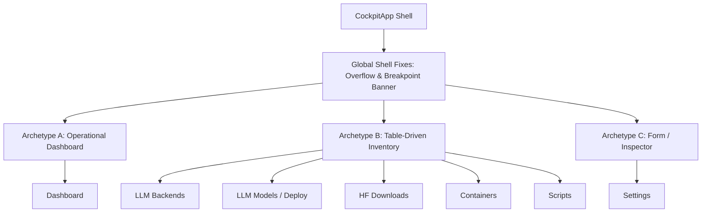

# Implementation Plan: Screen Archetypes & Cockpit Redesign

Establish 3 canonical screen archetypes across `llm-server-cockpit`, eliminate global layout defects (phantom vertical scrollbars, ASCII banner wrapping on narrow viewports), purge verbose explanatory text across all 7 screens, and standardize table interaction and modal ergonomics.

---

## User Review & Constructive Pushback

### 1. In-Cell Table Buttons vs. Contextual Action Bar
> [!IMPORTANT]
> **Substantive Pushback on In-Cell Buttons (Requirement 2a)**:
> In Textual (`textual==8.2.8`), `DataTable` cells accept `RenderableType` only (plain text, Rich `Text`, `Segment`). Passing a `Button` to a cell renders only its visual character representation—it is **not mounted in the DOM**, cannot receive keyboard focus, cannot receive click events, and does not emit `Button.Pressed`.
> 
> **Proposed Solution (Canonical Textual Ergonomics)**:
> - **Batch Multi-Select Tables** (`SingleClickDataTable` in `builds.py`, `containers.py`, `scripts.py`, `downloads.py`):
>   - Column 0: `[ ]` / `[x]` toggle (click or spacebar to select/deselect).
>   - Primary Action Row (directly under table): Acts on all selected items ("Update selected", "Restart selected", "Download selected").
>   - Contextual Row Action: The highlighted row (cursor position) can have immediate single-row actions (e.g. "Rollback", "Logs") activated via button or pressing **Enter**.
> - This delivers the exact capability requested (single-row rollback + multi-row batch actions) without fighting Textual's widget architecture.

### 2. Differentiating Primary vs. Secondary Action Rows (Requirement 2c)
> [!TIP]
> **Button Hierarchy & Visual Separation**:
> To prevent two stacked rows of buttons from blending together into an unreadable grid:
> 1. **Primary Row (Direct Action)**: Positioned directly beneath the table. Contains operation buttons that mutate state ("Update selected", "Rollback", "Start", "Stop"). Styled with semantic variants (`$primary`, `$accent`, or `$error` for danger).
> 2. **Secondary Row (Inspection & Popups)**: Positioned with subtle vertical separation (`margin-top: 1`). Contains read-only inspection triggers ("View Build History", "Container Logs", "Preview YAML"). Styled as thin, low-contrast ghost buttons (`$surface` background, `$text-muted` label).

### 3. Direct Model Input on Hugging Face Downloads (Requirement 0b)
> [!NOTE]
> Currently, `downloads.py` exclusively parses models from `models.yaml`. Adding ad-hoc download support makes downloads dramatically more flexible.
> 
> **Mechanism**:
> - Place an inline input strip above the download table: `[ HF Repo / Quant Filename Input ] [ Download GGUF Button ]`.
> - When an ad-hoc model is downloaded, it stores to disk (`models/` cache) and automatically adds an entry into `models.yaml` with status `downloaded` (or prompts whether to register it for inference routing).

---

## Open Questions for Operator Alignment

> [!WARNING]
> Please confirm your preferences on the following 2 architectural choices:

1. **Ad-hoc Hugging Face Model Registration**:
   - **Option A (Recommended)**: Downloading an ad-hoc model writes its weight to disk AND registers a template entry into `models.yaml` (engine: `llama-cpp`, context: 4096, quant: `<parsed-quant>`) so it is immediately deployable on the Deploy tab.
   - **Option B**: Download purely to disk; operator must switch to Deploy tab to import/declare it into `models.yaml`.
2. **Settings Screen Standardization (Requirement 7)**:
   - **Option A (Recommended)**: Preserve the 3 sub-tabs (`Host Profile`, `GPU Topology`, `System Services`) within `TabbedContent`, but strip all subtitle text and unify all forms into a strict 2-column key-value inspector layout (`[Field Label: 24 cols] [Input / Switch / Readout: 1fr]`) with a bottom action bar per tab.
   - **Option B**: Flatten Settings into a single scrollable document with bordered section boxes. *(We recommend Option A because flattening easily re-introduces the 80x24 scroll clipping issues solved in Phase 3)*.

---

## Screen Archetypes Definition

Every screen in `llm-server-cockpit` will inherit from `CockpitScreenBase` and adhere to one of three strictly defined archetypes:



### Archetype A: Operational Dashboard (`dashboard.py`)
- **Purpose**: Persistent, glanceable telemetry and stack health.
- **Layout**: 2-column responsive layout (`#dashboard-columns.columns-responsive`). Collapses to single column on `Screen.-narrow` (< 120 cols).
- **Left Panel (Hardware & Telemetry)**:
  - Compressed 1-line resource gauges: `[Label: 6] [ProgressBar: 1fr] [Value / Text: 18]`.
  - Rows: CPU Utilization, RAM, Disk (`/`), GPU Utilization, GPU VRAM. All fit in 5 lines.
- **Right Panel (Stack & Service Health)**:
  - System services (`llama-swap`, `tailscaled`, `tlp`).
  - Container health counts: `[✔ 4/4 Containers Running]`.
  - Active backend pointer and pending updates indicator (`[★ Update Available: llama.cpp b3600]`).
- **Text Discipline**: Zero boilerplate text. Zero introductory paragraphs. Section titles are 1-line uppercase badges.

### Archetype B: Table-Driven Inventory (`builds.py`, `containers.py`, `scripts.py`, `deploy.py`, `downloads.py`)
- **Purpose**: Multi-item inventory supervision and batch execution.
- **Layout**:
  1. **Top Input / Search Row** (where applicable): Left-aligned ad-hoc input or filter bar.
  2. **`CockpitDataTable` / `SingleClickDataTable`**: Full available width (`height: 1fr`), `fixed_columns >= 1`, explicit column widths.
  3. **Primary Action Row**: Positioned directly beneath table. Contains batch actions for ticked items (`[ ]` / `[x]`) and single-action triggers for highlighted row.
  4. **Secondary / Modal Action Row**: Flat ghost buttons for history/overview popups.
  5. **Popups Over Inline Panels**: Edit forms, YAML inspection, and history logs render inside centered modals (`ConfirmModal`, `InfoModal`, `EditModal`) rather than expanding inline panels that displace table layouts.

### Archetype C: Form / Inspector (`settings.py`)
- **Purpose**: System configuration and diagnostics.
- **Layout**:
  - Structured tab panes (`#settings-tabs`): `Host Profile`, `GPU Topology`, `System Services`.
  - Standardized field alignment: `.form-row` containing `[Label: 24] [Input / Select / Switch: 1fr]`.
  - Dedicated action bar docked at bottom of each tab panel.
  - Zero instructional filler text; field purpose communicated via placeholder text or input validation messages.

---

## Proposed Changes

### Global Shell & Design Standards

#### [MODIFY] [cockpit/app.py](file:///Users/nystrom/GitHub/llm-server-cockpit/cockpit/app.py)
- **Scrollbar Bug Fix**: Apply `Screen { overflow: hidden; }` and `TabbedContent { height: 1fr; margin: 0 2; }` to prevent the outer `Screen` from painting a vertical scrollbar across all tabs.
- **Responsive Banner**:
  - Update `HORIZONTAL_BREAKPOINTS = [(0, "-narrow"), (120, "-wide")]`.
  - In `CockpitHeader`, yield both `Static(ASCII_BANNER, id="banner-art")` and `Static("[bold #f5a623]LLM-SERVER-COCKPIT[/]", id="banner-compact")`.
  - In TCSS: Under `Screen.-narrow`, hide `#banner-art` and show `#banner-compact` (height: 2 lines). Under `Screen.-wide`, show `#banner-art` (height: 8 lines).

#### [MODIFY] [cockpit/widgets.py](file:///Users/nystrom/GitHub/llm-server-cockpit/cockpit/widgets.py)
- Add styling tokens and helper classes for:
  - `.res-row` (1-line label + progress bar + value readout for Dashboard).
  - `.action-row-primary` and `.action-row-secondary` button styling.
  - `.form-row` standardized 2-column key-value styling for Inspector forms.

#### [MODIFY] [cockpit/DESIGN.md](file:///Users/nystrom/GitHub/llm-server-cockpit/cockpit/DESIGN.md)
- Update §2 to reflect the 120-column breakpoint threshold for the ASCII banner.
- Add §8 detailing the 3 Screen Archetypes (Dashboard, Table-Driven Inventory, Form/Inspector) to prevent future screen regressions.

---

## Screen Refactoring (Archetype Conformance & Text Purge)

#### [MODIFY] [cockpit/screens/dashboard.py](file:///Users/nystrom/GitHub/llm-server-cockpit/cockpit/screens/dashboard.py)
- **Purge Text Noise**: Remove `"At-a-glance status across the LLM stack."`.
- **Telemetry Compression**: Replace bulky vertical `.gauge` blocks with compact 1-line `.res-row` entries containing Textual `ProgressBar` widgets for CPU, RAM, Disk, GPU, and VRAM.
- **Health Panel**: Consolidate Docker, Systemd, and Update notifications into concise status badges.

#### [MODIFY] [cockpit/screens/builds.py](file:///Users/nystrom/GitHub/llm-server-cockpit/cockpit/screens/builds.py)
- **Purge Text Noise**: Remove subtitle `"Manage llama.cpp builds..."`, instructional text `"Tick a llama.cpp backend..."`, `"Retained builds..."`, and empty status label `"selected for rollback: (none)"`.
- **Table Consolidation**:
  - In `backends-table`, add a `Pinned` column showing `[★]` or `[-]` per backend, eliminating the separate pinned readout.
  - Retain `builds-table` for compilation targets.
  - Convert `history-table` (retained builds) into a secondary popup triggered by a `[View Build History]` button in the secondary action bar, freeing 8+ vertical rows on the main view.

#### [MODIFY] [downloads.py](file:///Users/nystrom/GitHub/llm-server-cockpit/cockpit/screens/downloads.py)
- **Purge Text Noise**: Remove `"Hugging Face model weights download..."`, `"No llama-cpp models configured..."`, and the 4-line red Hugging Face auth warning box.
- **On-Demand Auth**: Check Hugging Face token only upon download initiation; if missing, trigger a lightweight token entry modal or status notification rather than occupying permanent screen space.
- **Ad-hoc Model Input**: Add an input strip: `Input(placeholder="hf-repo/model-name or GGUF URL...", id="adhoc-model-input")` + `Button("Download", id="adhoc-download-btn")`.

#### [MODIFY] [deploy.py](file:///Users/nystrom/GitHub/llm-server-cockpit/cockpit/screens/deploy.py)
- **Purge Text Noise**: Remove subtitle, redundant `Static("Models (models.yaml)", classes="section-title")`, and the 4-line import paragraph.
- **Modal Editing**: Convert inline `#edit-form` and `#import-box` into modal dialogs (`EditModelModal`, `ImportModelsModal`) to keep the primary view clean and eliminate vertical layout jumping.

#### [MODIFY] [containers.py](file:///Users/nystrom/GitHub/llm-server-cockpit/cockpit/screens/containers.py) & [scripts.py](file:///Users/nystrom/GitHub/llm-server-cockpit/cockpit/screens/scripts.py)
- **Purge Text Noise**: Strip subtitles and inline instructions.
- **Button Tiering**: Structure action bars into primary ("Restart selected", "Stop selected") and secondary ("Container Logs", "New Script").

#### [MODIFY] [settings.py](file:///Users/nystrom/GitHub/llm-server-cockpit/cockpit/screens/settings.py)
- **Purge Text Noise**: Strip header subtitles and redundant explanatory labels.
- **Form Standardization**: Align all inputs, switches, and readouts across `Host Profile`, `GPU Topology`, and `System Services` to use `.form-row`.

---

## Verification Plan

### Automated Verification
1. **Syntax & Compilation**:
   ```bash
   python3 -m py_compile cockpit/*.py cockpit/screens/*.py provision/*.py provision/steps/*.py
   ```
2. **Widget Enforcement Self-Check**:
   ```bash
   .venv/bin/python3 -m cockpit.widgets
   ```
3. **Automated Smoke & Geometry Suite**:
   ```bash
   .venv/bin/python3 smoke/verify_screens.py
   ```
   - Assert `Screen.show_vertical_scrollbar == False` when viewport fits content.
   - Assert `Screen.-narrow` (< 120 cols) displays `#banner-compact` and hides `#banner-art`.
   - Assert `Screen.-wide` (>= 120 cols) displays `#banner-art`.
   - Export 14 SVGs across all 7 tabs for visual review.

### Text Noise & Static Sweeps
1. `grep -rn "classes=\"subtitle\"" cockpit/screens/` $\to$ must return 0.
2. `grep -rn "add_column(" cockpit/screens/ | grep -v "width="` $\to$ must return 0.
3. `grep -rn "class.*Screen.*Widget" cockpit/screens/` $\to$ must return 0.

### Manual / Visual Verification
- Inspect exported SVG screenshots at 80×24 to confirm zero text wrapping, zero banner corruption, and clean single-column reflow.
- Verify ad-hoc Hugging Face download prompt and on-demand authentication.
